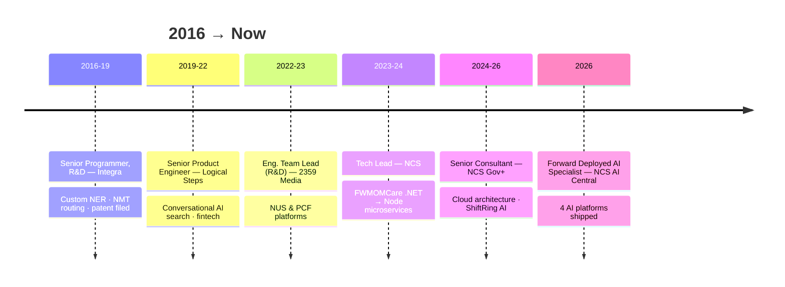

<!-- ============ HEADER ============ -->


<p align="center">
  
</p>

<p align="center">
  
  
  
</p>

<br/>

## `$ whoami`

```yaml
name: Prasanna Brabourame
role: Forward Deployed AI Specialist @ NCS AI Central
mission: "The gap between an AI demo and a production system is where I work."
years_in_tech: 10+
currently:
  - Embedded in Singapore Government GenAI & agentic AI programmes (Gov+ · Whole-of-Government)
  - Partnering with GovTech, Google and the National AI Group
  - Building with Claude, Gemini, Vertex AI Agent Engine & Model Context Protocol (MCP)
how_i_work:
  embed: "inside the client's walls — their use cases, constraints and data rules"
  build: "the whole system myself — front end, AI pipeline, security, infra"
  harden: "for the day after go-live — retries, watchdogs, audits, backstops"
speaks: [English, Tamil, TypeScript, Python, Go]
fun_fact: "I trust an LLM exactly as far as its deterministic backstop can throw it"
```

<br/>

## 🛰️ Flagship AI Deployments

> Production systems in domains where mistakes are expensive. Code is client-owned & private — war stories available over ☕.

<table>
  <tr>
    <td width="50%" valign="top">
      <h3>🕌 MUIS HIVA</h3>
      <p>
        
        
      </p>
      <p>AI document review for Singapore's halal certification authority — classifies <b>25 document types</b>, validates them against the full certification rule set, and never lets the LLM make a safety-critical call alone.</p>
      <p><code>React</code> <code>Firebase</code> <code>AISay</code> <code>Gemini</code></p>
    </td>
    <td width="50%" valign="top">
      <h3>🏛️ CSP ComplAI</h3>
      <p>
        
        
      </p>
      <p>Automates compliance review of Corporate Service Providers against <b>~40 ACRA rules</b> — severity is always stamped from the rule book, never inferred by the model. Findings a regulator can defend.</p>
      <p><code>React</code> <code>Python</code> <code>Firestore</code> <code>Gemini</code></p>
    </td>
  </tr>
  <tr>
    <td width="50%" valign="top">
      <h3>🛡️ SecWiz</h3>
      <p>
        
        
      </p>
      <p>From vulnerability to tested merge request, automatically — a <b>12-stage remediation pipeline</b> with <b>4 interchangeable LLM providers</b>. Fixes ship only when the tests pass.</p>
      <p><code>Node.js</code> <code>PostgreSQL</code> <code>Claude</code> <code>GPT</code> <code>Gemini</code> <code>Ollama</code></p>
    </td>
    <td width="50%" valign="top">
      <h3>🎓 NCS LighTool</h3>
      <p>
        
        
      </p>
      <p>Turns teacher tracking data into per-child learning insights — a Pub/Sub-driven agent pipeline (<b>retrieval → summarise → evaluate</b>) with end-to-end correlation tracing.</p>
      <p><code>Go</code> <code>Next.js</code> <code>Vertex AI Agent Engine</code></p>
    </td>
  </tr>
</table>

<br/>

## 🗄️ Complete Mission Archive

> Every deployment, 2016 → now. Expand an era to read the case files.

<details>
<summary><b>🏢 NCS Group — Singapore Government platforms · 2023 → now</b></summary>
<br/>

**ShiftRing AI** — AI-driven voice + chat customer support: natural-language understanding, multilingual responses, automated ticket creation.
`AI` `NLU` `Voice` `Chat Automation`

**FWMOMCare** — National migrant-worker health-monitoring app. Led the re-platform from a .NET monolith to Node.js/NestJS microservices, migrating MSSQL → PostgreSQL along the way.
`Node.js` `NestJS` `PostgreSQL` `Microservices`

**Exit Pass** — Manages exit permissions and location quotas for migrant-worker dormitory residents; integrated with SafeEntry and SGWorkPass.
`GovTech` `National Integrations`

**MW Data Hub** — Data platform tracking Access Code status for migrant workers, supporting COVID-19 containment policy.
`Data Platform` `GovTech`

**Safe at Work** — Portal for employers to verify the Access Code status of Work Permit, S Pass, and Employment Pass holders.
`GovTech` `Employer Services`

</details>

<details>
<summary><b>🚀 2359 Media — Team Lead (R&D) & Principal Engineer · 2022 → 2023</b></summary>
<br/>

**NUS IASS** *(National University of Singapore)* — Platform connecting students to paid gig work that counts toward internship credit, giving businesses wider talent access. Shipped across web, iOS, and Android.
`Node.js` `React` `Strapi` `PostgreSQL` `Payment Gateway`

**PCF Operational Relief-Staff App** *(PAP Community Foundation)* — End-to-end relief-staff assignments, from job creation through payroll, spanning a CMS application and mobile app.
`Node.js` `React` `AWS` `PostgreSQL`

</details>

<details>
<summary><b>🧪 Logical Steps — Senior Product Engineer · 2019 → 2022</b></summary>
<br/>

**Ola Search Platform Suite** *(technical lead, 12-person team)* — Conversational AI search: an NLP search engine on Apache Solr, a context-aware query engine, an intent engine matching queries to answers, the OlaBot chatbot (voice + text, rich-media responses, guided transactions), OlaNLP grammar/style correction, and an admin console for relevancy tuning.
`Python` `Node.js` `React` `Solr` `Elasticsearch` `Docker` `Kubernetes` `TensorFlow`

**LNDDO** — Fintech platform assessing SME creditworthiness from digital-footprint data to offer short-term business credit lines (UAE market). Architecture & framework design team.
`Node.js` `React` `MongoDB` `Azure` `Redis`

**CardsPe (Zupcash)** — Offline-to-online commerce: merchants launch online stores shareable through chat apps. Built from scratch — APIs, auth/storage microservices, orchestration middleware, data modelling.
`Node.js` `Next.js` `MongoDB` `AWS` `Redis` `Elasticsearch`

**VISSION** — Web-scraping platform: message queues between microservices, LDAP sign-in module, Express API proxy.
`Python` `Flask` `Scrapy` `Puppeteer` `AWS Lambda`

**LS MQTT** — Publisher-subscriber messaging on HiveMQ MQTT with a dynamic channel-management UI and an embedded-microcontroller proof of concept.
`Node.js` `Next.js` `MQTT` `HiveMQ` `IoT`

**Power App** — Blockchain dashboard integrating Ethereum smart contracts via Web3: live transaction history, chain state, and exchange data feeds.
`Solidity` `Ethereum` `Web3` `NFT` `Truffle`

</details>

<details>
<summary><b>📚 Integra Software Services — Senior Programmer, Innovation & R&D · 2016 → 2019</b></summary>
<br/>

**iNLP** *(18-person team)* — NLP engine for publishing: cognitive rule engine, custom spaCy NER models, FastText language detection routing to Hugging Face neural machine translation, MinHash/LSH de-duplication at scale, LSTM/CNN deep learning, and transfer learning with BERT, GPT-2, and T5; Rasa-based chatbot.
`Python` `spaCy` `NLTK` `TensorFlow` `Hugging Face` `Rasa`

**iAuthor / iCorrectProof** — Online author-proofing editor for Adobe InDesign content, designed from scratch as Scrum Master/SPOC: real-time grammar checking over sockets, an Electron desktop app plus PWA, automated multi-format document delivery, and blockchain-based peer review with Stripe/PayPal.
`React` `Redux` `Electron` `Express` `Azure` `WebSockets`

**Project X (R&D)** — InDesign-replacement rendering engine: in-browser PDF-as-HTML rendering via HTML Canvas. The work led to a **patent application**.
`Node.js` `Canvas` `PDF.js` `Font Rendering`

**WK Digital Book Platform** — Digital book platform with in-browser PDF rendering, a cron-based file-import engine, and localisation.
`ASP.NET Web API` `MS SQL` `Angular`

**iRights & Pearson platforms** — iRights: rights/permissions management for photo research (budgets, licensing scope, legal risk). Pearson Image Atlas (WCAG 2.0 AA accessible) and Video Collection (MyLab SSO).
`.NET` `Angular` `Accessibility`

</details>

<details>
<summary><b>🌍 Open Source & Side Quests</b></summary>
<br/>

**COVID-19 Dashboards** — Built the Tamil Nadu COVID-19 dashboard and a real-time SAARC impact visualisation; contributed district-level GeoJSON to the Covid India project.
`React` `D3` `GeoJSON`

**npm Packages** — 13 published open-source packages on [npm](https://www.npmjs.com/~prasannabrabourame).
`Node.js` `Open Source`

</details>

<br/>

## 🗺️ Decade in Deployment



<br/>

## 🧰 Technical Arsenal

**🤖 AI / LLM**

<p>
  
  
  
  
  
  
  
  
  
  
</p>

**⚙️ Languages & Backend**

<p>
  <a href="https://skillicons.dev"></a>
</p>

**🎨 Frontend**

<p>
  <a href="https://skillicons.dev"></a>
</p>

**☁️ Cloud, Data & DevOps**

<p>
  <a href="https://skillicons.dev"></a>
</p>

<br/>

## 📊 Telemetry

<table>
  <tr>
    <td></td>
    <td></td>
  </tr>
  <tr>
    <td></td>
    <td></td>
  </tr>
</table>


<br/>

## ✍️ Latest Field Notes

📝 I write about AI engineering, Docker, and production war stories on [Medium](https://medium.com/@prasannabrabourame) · 🏅 Verified badges on [Credly](https://www.credly.com/users/prasanna-brabourame)

<table>
  <tr>
    <td><a target="_blank" href="https://github-readme-medium-recent-article.vercel.app/medium/@prasannabrabourame/0"></a></td>
  </tr>
  <tr>
    <td><a target="_blank" href="https://github-readme-medium-recent-article.vercel.app/medium/@prasannabrabourame/1"></a></td>
  </tr>
  <tr>
    <td><a target="_blank" href="https://github-readme-medium-recent-article.vercel.app/medium/@prasannabrabourame/2"></a></td>
  </tr>
</table>

<br/>

## 🤝 Open Channels

<p>
  <a href="https://linkedin.com/in/prasannabrabourame"></a>
  <a href="https://medium.com/@prasannabrabourame"></a>
  <a href="https://stackoverflow.com/users/6703980"></a>
  <a href="https://dev.to/prasannabrabourame"></a>
  <a href="https://twitter.com/prasannabrabour"></a>
  <a href="https://kaggle.com/prasannabrabourame"></a>
  <a href="https://www.hackerrank.com/prasanna_b"></a>
  <a href="https://codepen.io/prasannabrabourame"></a>
  <a href="https://www.upwork.com/freelancers/~0127b08168f0a845c2"></a>
</p>

<p>
  <a href="https://calendly.com/prasannabrabourame/15min"></a>
  <a href="mailto:prasanna18101994@gmail.com"></a>
</p>

## ☕ Fuel the Mission

<p>
  <a href="https://www.buymeacoffee.com/prasana"></a>
  <a href="https://ko-fi.com/prasannabrabourame"></a>
</p>

<!-- Optional: contribution snake — enable the Platane/snk GitHub Action in this repo, then uncomment:

-->


